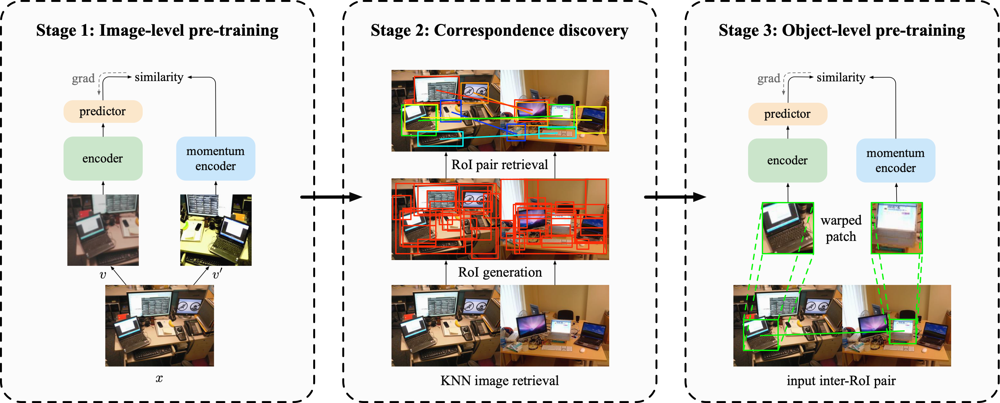

# Unsupervised Object-Level Representation Learning from Scene Images

This repository contains the official PyTorch implementation of the ORL algorithm for self-supervised representation learning.

> [**Unsupervised Object-Level Representation Learning from Scene Images**](https://arxiv.org/abs/2106.11952),  
> Jiahao Xie, Xiaohang Zhan, Ziwei Liu, Yew Soon Ong, Chen Change Loy  
> In NeurIPS 2021  
> [[Paper](https://arxiv.org/abs/2106.11952)][[Project Page](https://www.mmlab-ntu.com/project/orl/index.html)][[Bibtex](https://github.com/Jiahao000/ORL#citation)]



## Updates
- [12/2021] Code and pre-trained models of ORL are released.

## Installation
Please refer to [INSTALL.md](docs/INSTALL.md) for installation and dataset preparation.

## Models
Pre-trained models can be downloaded from [Google Drive](https://drive.google.com/drive/folders/1oWzNZpoN_SPc56Gr-l3AlgGSv8jG1izG?usp=sharing). Please see our paper for transfer learning results on different benchmarks.

## Usage

### Stage 1: Image-level pre-training

You need to pre-train an image-level contrastive learning model in this stage. Take BYOL as an example:
```shell
bash tools/dist_train.sh configs/selfsup/orl/coco/stage1/r50_bs512_ep800.py 8
```
This stage can be freely replaced with other image-level contrastive learning models.

### Stage 2: Correspondence discovery

- **KNN image retrieval**

First, extract all features in the training set using the pre-trained model weights in Stage 1:
```shell
bash tools/dist_train.sh configs/selfsup/orl/coco/stage1/r50_bs512_ep800_extract_feature.py 8 --resume_from work_dirs/selfsup/orl/coco/stage1/r50_bs512_ep800/epoch_800.pth
```
Second, retrieve KNN for each image using `tools/coco_knn_image_retrieval.ipynb`. The corresponding KNN image ids will be saved as a json file `train2017_knn_instance.json` under `data/coco/meta/`.

- **RoI generation**

Apply selective search to generate region proposals for all images in the training set:
```shell
bash tools/dist_selective_search_single_gpu.sh configs/selfsup/orl/coco/stage2/selective_search_train2017.py data/coco/meta/train2017_selective_search_proposal.json
```
The script and config only support single-image single-gpu inference since different images can have different number of generated region proposals by selective search, which cannot be gathered if distributed in multiple gpus. You can also directly download [here](https://drive.google.com/drive/folders/1yYsyGiDjjVSOzIUkhxwO_NitUPLC-An_?usp=sharing) under `data/coco/meta/` if you want to skip this step.

- **RoI pair retrieval**

Retrieve top-ranked RoI pairs:
```shell
bash tools/dist_generate_correspondence_single_gpu.sh configs/selfsup/orl/coco/stage2/r50_bs512_ep800_generate_all_correspondence.py work_dirs/selfsup/orl/coco/stage1/r50_bs512_ep800/epoch_800.pth data/coco/meta/train2017_knn_instance.json data/coco/meta/train2017_knn_instance_correspondence.json
```
The script and config also only support single-image single-gpu inference since different image pairs can have different number of generated inter-RoI pairs, which cannot be gathered if distributed in multiple gpus. A workaround to speed up the retrieval process is to split the whole dataset into several parts and process each part on each gpu in parallel. We provide an example of these configs (10 parts in total) in `configs/selfsup/orl/coco/stage2/r50_bs512_ep800_generate_partial_correspondence/`. After generating each part, you can use `tools/merge_partial_correspondence_files.py` to merge them together and save the final correspondence json file `train2017_knn_instance_correspondence.json` under `data/coco/meta/`.

### Stage 3: Object-level pre-training

After obtaining the correspondence file in Stage 2, you can then perform object-level pre-training:
```shell
bash tools/dist_train.sh configs/selfsup/orl/coco/stage3/r50_bs512_ep800.py 8
```

### Transferring to downstream tasks
Please refer to [GETTING_STARTED.md](docs/GETTING_STARTED.md#benchmarks) for transferring to various downstream tasks.

## Acknowledgement
We would like to thank the [OpenSelfSup](https://github.com/open-mmlab/OpenSelfSup) for its open-source project and [PyContrast](https://github.com/HobbitLong/PyContrast) for its detection evaluation configs.

## Citation
Please consider citing our paper in your publications if the project helps your research. BibTeX reference is as follows:
```bibtex
@inproceedings{xie2021unsupervised,
  title={Unsupervised Object-Level Representation Learning from Scene Images},
  author={Xie, Jiahao and Zhan, Xiaohang and Liu, Ziwei and Ong, Yew Soon and Loy, Chen Change},
  booktitle={NeurIPS},
  year={2021}
}
```
